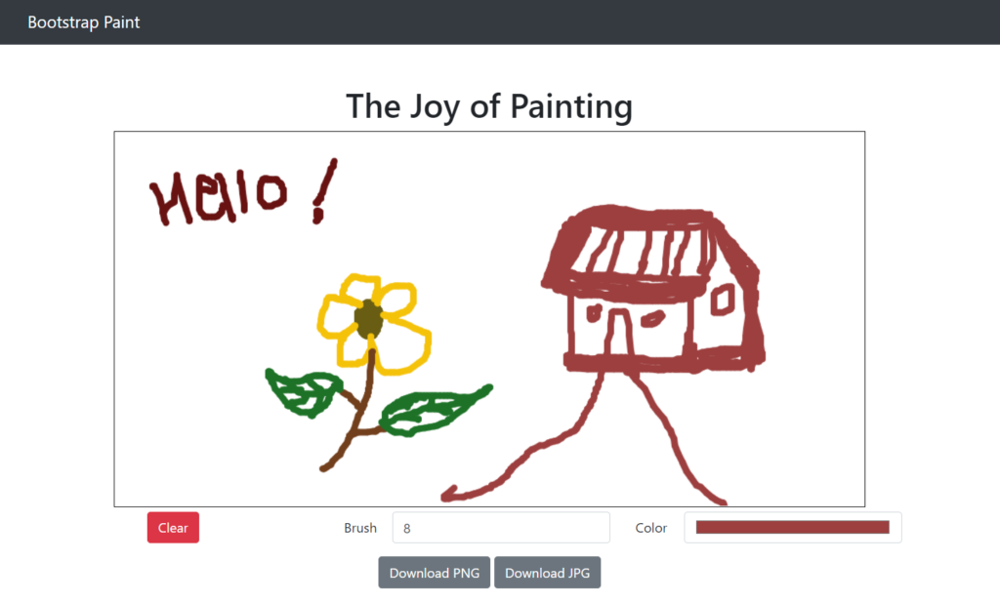

# 🎨 Painting App – JavaScript + HTML5 Canvas

A simple and interactive **drawing application** built using **HTML5**, **CSS3**, and **vanilla JavaScript**. This painting app allows users to draw freely using the mouse cursor, clear the canvas with a single click, and **download their sketches as image files**. It's designed for creative exploration in the browser without any dependencies or frameworks.

---

## ✨ Features

- 🖌️ **Canvas Drawing**
  - Draw freely using your mouse or touch input
- 🧽 **Clear Canvas**
  - Wipe the board instantly and start a new sketch
- 💾 **Download Drawing**
  - Save your sketch locally as a `.png` image
- ⚡ **Real-Time Rendering**
  - Built with `requestAnimationFrame` or canvas context for smooth input
- 📱 **Mobile-Friendly**
  - Works across desktop and modern mobile browsers

---

## 🚀 How to Run

1. **Download or Clone the Project**
   ```bash
   git clone https://github.com/your-username/js-painting-app.git
   cd js-painting-app
   ```

2. **Launch the App**
   - Double-click `index.html` to open in your browser
   - Or right-click → “Open with...” → select your preferred browser (Chrome or Firefox recommended)

---

## 🛠️ Tech Stack

| Tech       | Role                      |
|------------|---------------------------|
| HTML5      | Canvas and layout         |
| CSS3       | Styling and responsiveness|
| JavaScript | Event handling + rendering|

---

## 📁 File Structure

```
painting-app/
├── index.html        # App layout and canvas
├── style.css         # Styling and layout structure
├── script.js         # Drawing logic and controls
└── README.md
```

---

## 📸 Screenshots


---
